# *Taggy Sustain: Mensurando Impacto Ambiental*
Uma iniciativa em parceria com a Edenred Brasil e Taggy para transformar conveniência em consciência ecológica.

##  Sobre a Taggy
A Taggy é uma solução white-label de pagamento automático de pedágios e estacionamentos via tecnologia RFID. Atuando em parceria com bancos e fintechs, o serviço permite que o débito seja feito diretamente na conta ou cartão do cliente, eliminando paradas desnecessárias e recargas manuais.

##  O Problema
 1. Embora a tecnologia RFID da Taggy seja inerentemente sustentável, existe uma lacuna de percepção:

 2. Frenagens e Retomadas: O ato de parar e arrancar em cabines de pedágio aumenta significativamente a emissão de CO2.

 3. Desperdício de Papel: O uso de tickets físicos em estacionamentos gera lixo desnecessário.

 4. Falta de Dados: Atualmente, os usuários não conseguem visualizar ou mensurar o quanto estão ajudando o planeta ao utilizar o serviço.

##  Nossa Missão
Nossa missão é tangibilizar a sustentabilidade. Queremos permitir que os usuários do sistema compreendam o impacto ambiental evitado de maneira clara e objetiva.

Através de métricas precisas (como redução de emissão de carbono e economia de papel), pretendemos manter o interesse do usuário focado em práticas sustentáveis, transformando cada passagem pelo pedágio em um ponto positivo para o meio ambiente.

##  Desenvolvimento e Planejamento
Para acompanhar a evolução das funcionalidades, utilizamos o Trello como nossa ferramenta de gestão ágil.

##  Quadro de Gerenciamento (Overview)
No quadro abaixo, você encontrará os tickets detalhando desde a concepção da lógica de cálculo de CO2 até a interface do dashboard sustentável de todo o projeto.

<table>
  <tr>
    <td align="center" valign="top" width="50%">
      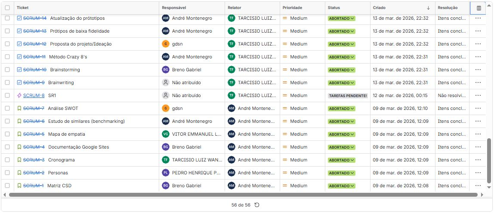
    </td>
    <td align="center" valign="top" width="50%">
      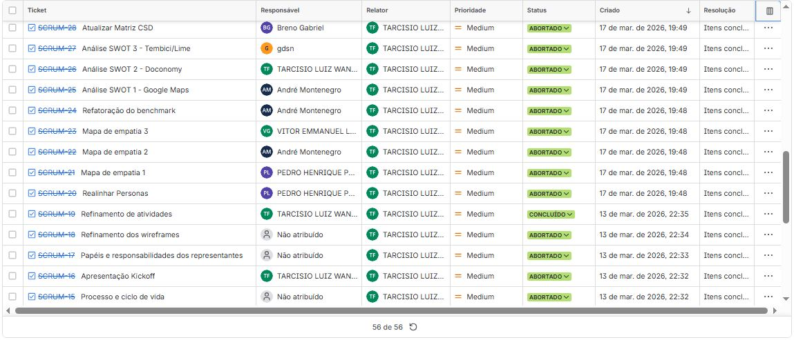
    </td>
    </tr>
</table>
<table>
  <tr>
    <td align="center" valign="top" width="50%">
      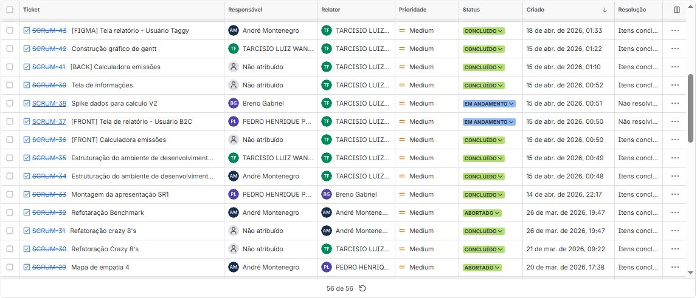
    </td>
    <td align="center" valign="top" width="50%">
      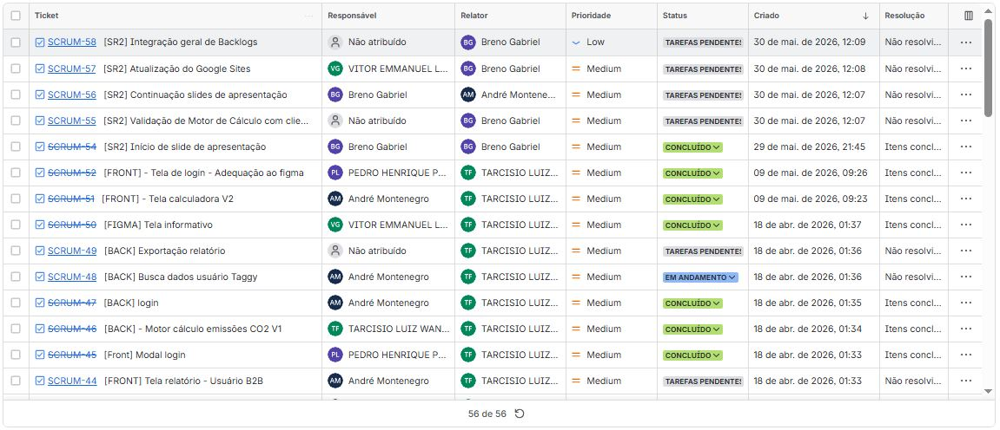
    </td>
  </tr>
</table>

Link do Projeto: [Acesse o Backlog aqui](https://projetos2-grupo6.atlassian.net/jira/software/projects/SCRUM/boards/1/backlog?atlOrigin=eyJpIjoiZTRiMGM3NDUzN2I0NDgxOGJjMTllMmIzZmQ3MTBhNjAiLCJwIjoiaiJ9)

##  Design de Experiência e Fluxos do Sistema
Nesta seção, detalhamos a fundação visual e lógica do projeto, abrangendo desde a concepção inicial das ideias até o mapeamento detalhado das interações do usuário.

##  Demonstração de Uso 
Abaixo, você pode conferir o funcionamento da interface em tempo real. O vídeo demonstra o fluxo completo desde o login até a finalização da tarefa principal.

<a href="Showcase/WhatsApp Video 2026-04-06 at 20.07.01.mp4">Clique aqui para baixar o arquivo.</a>

#### 📺Narração de Uso
 - Olá! Bem-vindos à apresentação do nosso novo dashboard da Taggy, Hoje vamos explorar a tela de Resumo de Emissões.
 - Logo no centro, o grande destaque é o nosso Score Verde, o que indica um índice de sustentabilidade acima da média.
 - Ao lado, temos nossos indicadores principais, Acompanhamos também os nossos custos logísticos, registrando 2 passagens por pedágios e 4 abastecimentos no mês, que totalizaram um gasto de 312 reais.
 - Para garantir total transparência, a tabela inferior mostra o Histórico de abastecimentos. Aqui detalhamos as datas, os postos utilizados.
 - Por fim, temos o painel lateral com fácil acesso a relatórios e a opção rápida de exportar tudo para PDF no botão superior esquerdo.

###  Prototipagem de Baixa Fidelidade (Lo-Fi)
Utilizamos o Figma para a criação de esboços iniciais, focando na arquitetura da informação e na jornada do usuário sem a distração de elementos visuais complexos.

Sketches & Storyboards: Elaboramos um conjunto de 10 storyboards que ilustram o contexto de uso e a resolução de problemas para nossas principais User Stories.
<table>
  <tr>
    <td align="center" valign="top" width="50%">
      
    </td>
    <td align="center" valign="top" width="50%">
      
    </td>
  </tr>
</table>

Acesso: [Acesse o Protótipo Aqui](https://www.figma.com/design/ScnWCZGtlDMBqQJet72IQf/Prot%C3%B3tipo?node-id=0-1&t=cmAqJUl7k85OB9sx-1)

Os arquivos também encontram-se anexados aos respectivos cards de tarefa no Trello.

##  Diagramas de Atividades
Para garantir que a lógica do sistema esteja alinhada às necessidades do negócio, cada História de Usuário (User Story) possui um diagrama de atividades correspondente. Estes diagramas mapeiam o fluxo lógico, decisões do sistema e caminhos alternativos.

###  Nota de Acesso 
Para manter este README conciso e evitar excesso de informações visuais, os links abaixo direcionam diretamente para os anexos nos respectivos cards do Trello, onde a documentação técnica está centralizada.

##  Ciclos de Entrega
Abaixo, detalhamos o cronograma planejado para as Sprints do projeto:
<table>
  <tr>
    <td align="center" valign="top" width="50%">
      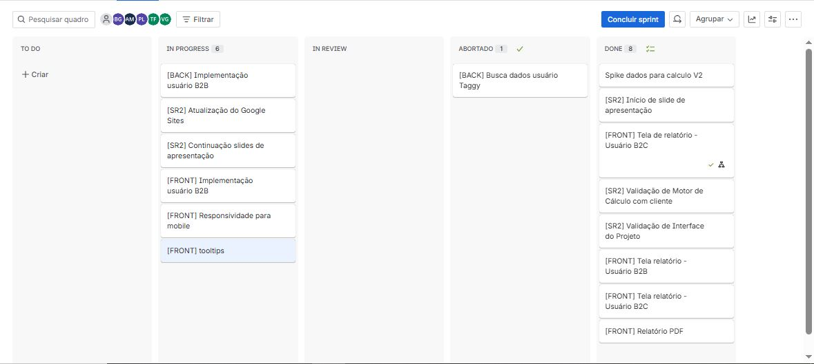
    </td>
  </tr>
</table>

## Desenvolvimento

### Issue/Bug Tracker 
O gerenciamento de tarefas, bugs e novas funcionalidades está sendo mantido ativamente através do Bakclog do Jira. 
Abaixo está a demonstração visual do estado atual do nosso tracker:

- Issue 01
Falha de conexão de login
> Status: Consertado 
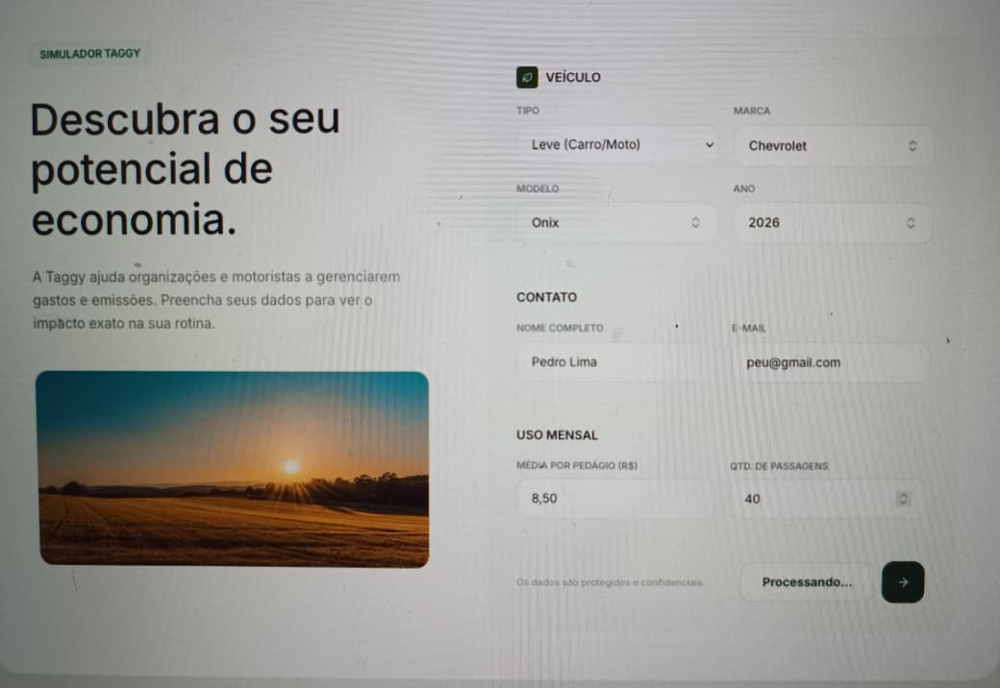

- issue 02
Tela Informativa falha durante desenvolvimento
> Status: Abortado
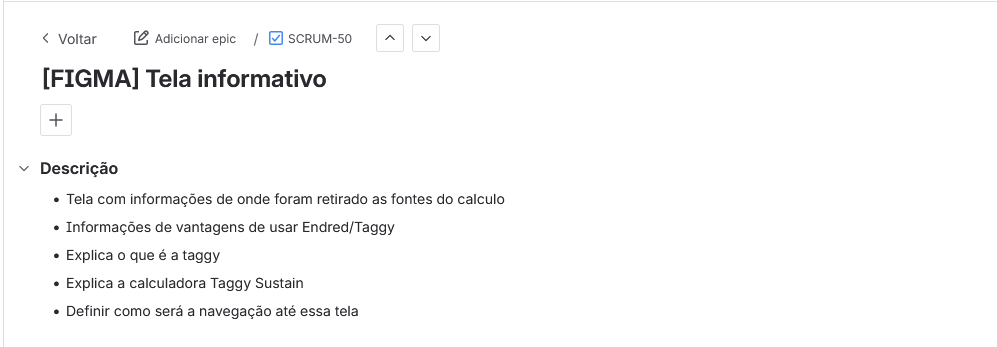

- issue 03
Delay em definição de Spike de Cálculos
> Status: Consertado
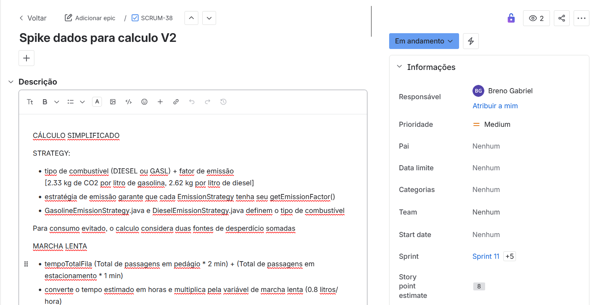

- issue 04
Tooltip de exposição de funcionamento interno do sistema
> Status: Não Concluido
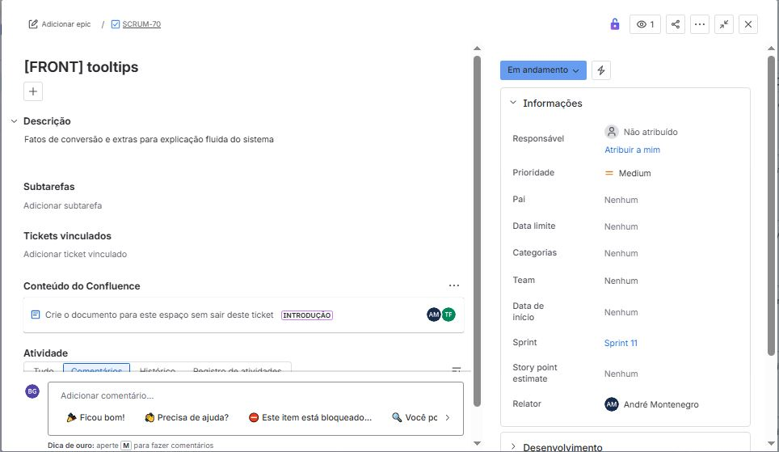

- issue 05
Definição clara de pontos do cálculo pelas tooltips, documentando fontes para variáveis e conversões
> Status: Não Concluido
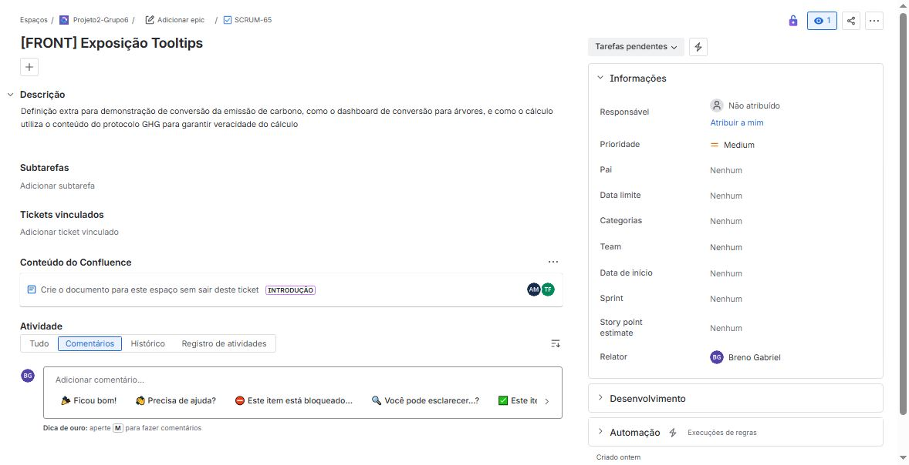

- issue 06
Falta do ambiente do Back-End para relatório de emissão e opção de export
> Status: Não Concluido
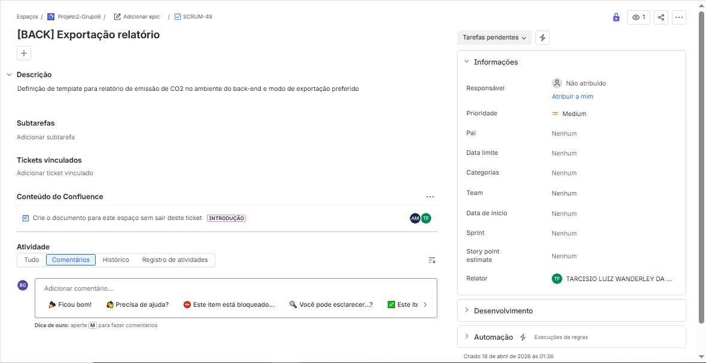

- issue 07
Definição de campo de dados do usuário
> Status: Abortado
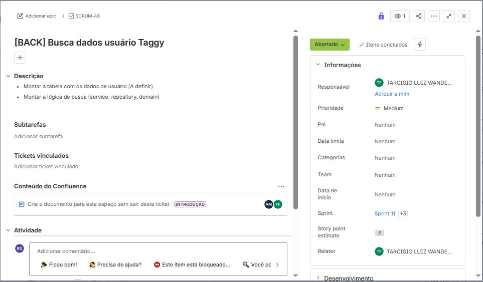

### Testes de Sistema
Para garantir a estabilidade e o funcionamento correto das principais jornadas do usuário, realizamos testes de sistema manuais. 

* **Evidência de Execução:** O screencast mostrando a execução completa dos testes de sistema foi anexado correspondente no nosso quadro de tarefas.
- Acesso: [Acesse o Screencast aqui](https://github.com/M4ntic0rE-H/projetos-2-gp6/blob/main/Showcase/2026-06-01%2015-35-57.mp4)

### Programação em Par (Pair Programming)
Experimentamos a prática de programação em par durante o desenvolvimento desta entrega para compartilhar conhecimento e aumentar a qualidade do código. Abaixo está o relato das funcionalidades desenvolvidas:

#### Relato da Experiência
- *O notebook de Pedro Lima teve problemas ao rodar o novo codigo da tela inicial junto com as novas implememntações do projeto, então Andre Montenegro seguiu o codigo de onde Pedro tinha parado onde ele pode atualizar e padronizar o codigo.*
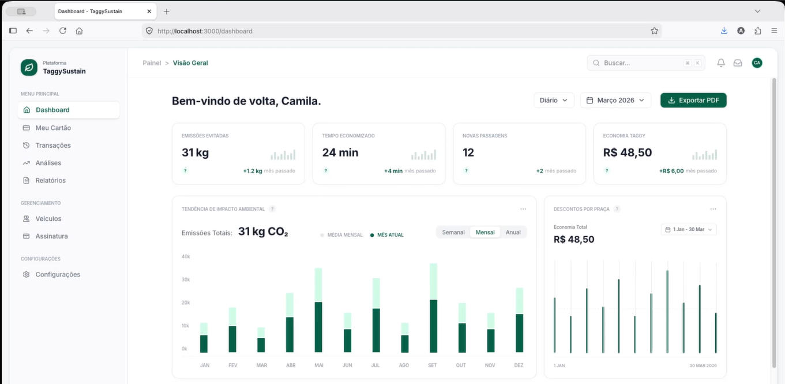

- *A parte de front-end ficou responsável por Pedro Lima e a contraparte foi suplementada Por Andre Montenegro, ligando os pontos de requisição com o banco de dados no back-end*
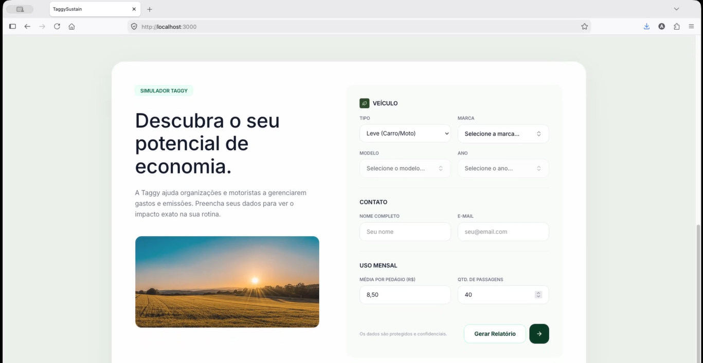

##  Integração com Jira
Para manter a rastreabilidade do projeto:

 1. Cada ticket expressa uma marca e cria uma história do projeto

 2. Mudanças nos requisitos refletem atualizações imediatas nos diagramas listados acima.

 3. Status de cada ticket demosntram como o projeto fluiu de acordo com expectativas prévias

##  Autores

| Nome              | Papel                   | E-mail             |
| :---------------- | :---------------------- | :----------------- |
| _Breno Gabriel_   | Desenvolvedor Front-End & Assistant Organizer | bgas@cesar.school  |
| _Pedro Lima_   | Desenvolvedor Back-End | phpl@cesar.school |
| _Tarcisio Wanderley_ | Product Owner & Desenvolvedor FullStack | tlwsf@cesar.school  |
| _Gilberto Dias_    | Desenvolvedor Back-End | gdsn@gmail.com |
| _André Montenegro_   | Tech-Lead & Desenvolvedor FullStack | agmos@cesar.school |
| _Vitor Emmanuel_   | Desenvolvedor Front-End | velfg@cesar.school  |

---

Disciplina de SI2026.01 - Fundamentos de Desenvolvimento de Software.

